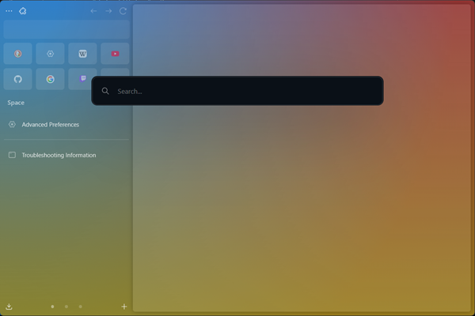
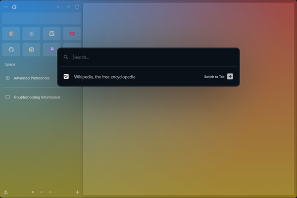
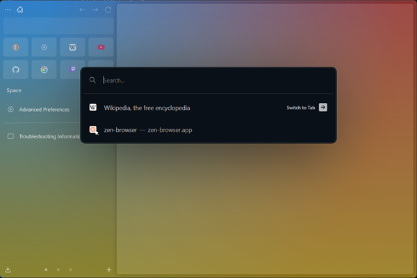

# No Top Sites

Annoyed with top sites that appear when you open the URL bar? With this mod, you can now hide them!

# Settings

## Hide all

Hide all suggestions results

## Hide only top sites

Will only hide top sites. For example, opened tabs will still be displayed.

## Hide only non-pinned top sites

As a reminder, top sites are managed in the `about:home` tab. One can pinned top sites, so this setting will only hide non-pinned top sites.

